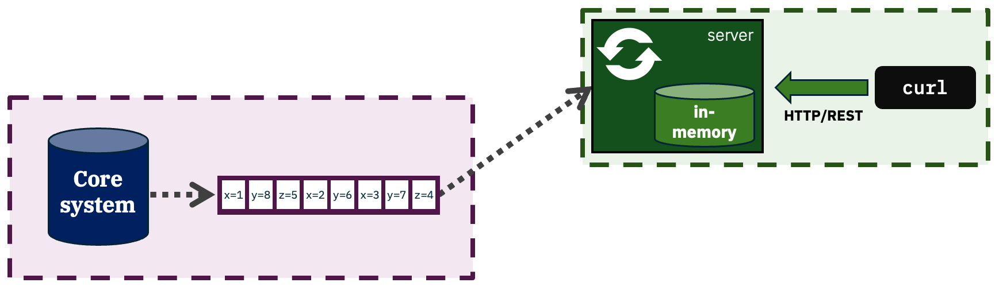

# In-memory lookup table



To compile:
```sh
mvn package
```

To run locally (using a local Kafka and [Kafka Connect](../local-testing/)):
```sh
mvn liberty:run
```

To build a containerized demo application and push it to OpenShift:
```sh
./build.sh
```

To deploy on OpenShift:
```
oc apply -f k8s.yaml
```
